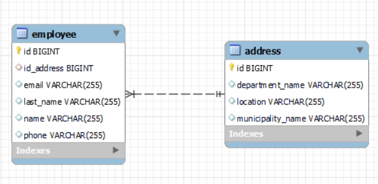
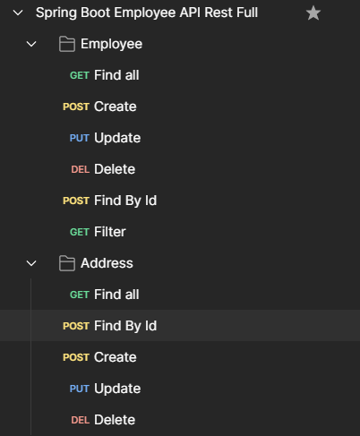

# Spring Boot API Rest Full de empleados

API Rest Full y filtro de empleados usando el framework de Spring Boot de Java, usando
JPA, Hibernate, MySQL, Lombok, Validators y el patron de diseño Builder integrado en Lombok

## DER

## Coleccion de Postman
